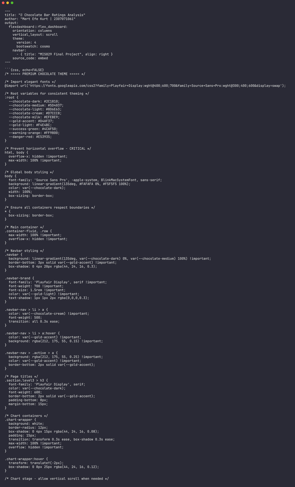

# MIS029 Chocolate Dashboard

<div align="center">


</div>

MIS029 Chocolate Dashboard is an R Markdown flexdashboard that explores chocolate bar ratings by company, origin, cocoa percentage, ingredient count, and tasting characteristics. It packages the final analysis as an interactive HTML dashboard.



## Features

- Interactive flexdashboard layout
- Chocolate-themed visual styling
- Value boxes for headline metrics
- Rating, origin, manufacturer, and ingredient analysis
- Data table views for detailed inspection
- Standalone generated HTML output

## Quick Start

```bash
git clone https://github.com/mertefekurt/MIS029-Chocolate-Dashboard.git
cd MIS029-Chocolate-Dashboard
```

Open the rendered dashboard:

```text
docs/index.html
```

To rebuild from R:

```r
rmarkdown::render("MertEfeKurt_2307071061_Final.Rmd")
```

## Project Structure

```text
MertEfeKurt_2307071061_Final.Rmd   Source R Markdown dashboard
MertEfeKurt_2307071061_Final.html  Rendered dashboard artifact
docs/index.html                    Publishable dashboard page
chocolate.csv                      Chocolate bar rating dataset
_site.yml                          Site configuration
```

## Dataset

The dataset includes manufacturer, company location, review date, bean origin, bar name, cocoa percentage, ingredients, memorable characteristics, and rating fields.
