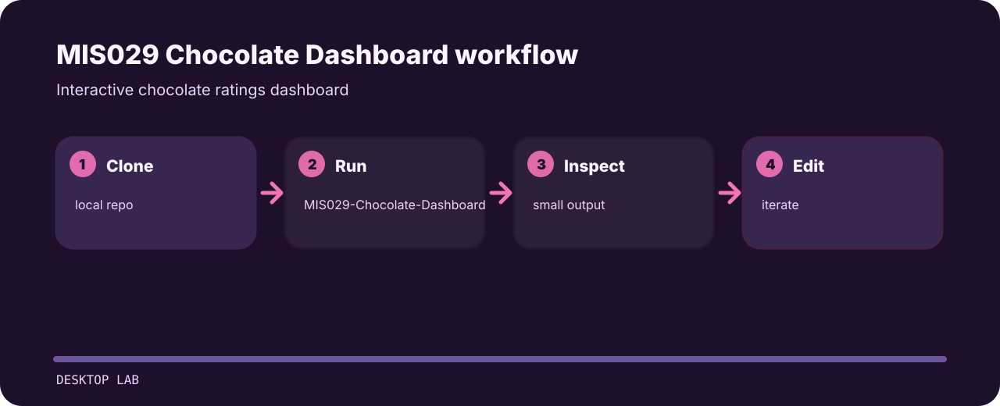

# MIS029 Chocolate Dashboard


Interactive chocolate ratings dashboard.

## Project route



## Run it locally

```bash
git clone https://github.com/mertefekurt/MIS029-Chocolate-Dashboard.git
cd MIS029-Chocolate-Dashboard
MIS029-Chocolate-Dashboard
```

## Notes from the build

- Designed as a focused desktop lab repo.
- Keeps setup short.
- Prioritizes readable output over infrastructure.

## Repository tour

```text
docs/                              published artifact
.gitignore                         project file
_site.yml                          project file
chocolate.csv                      project file
MertEfeKurt_2307071061_Final.html  project file
```
